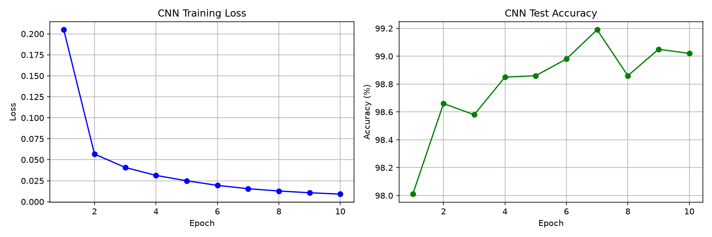
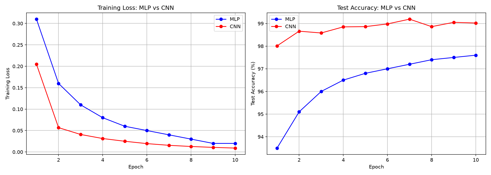
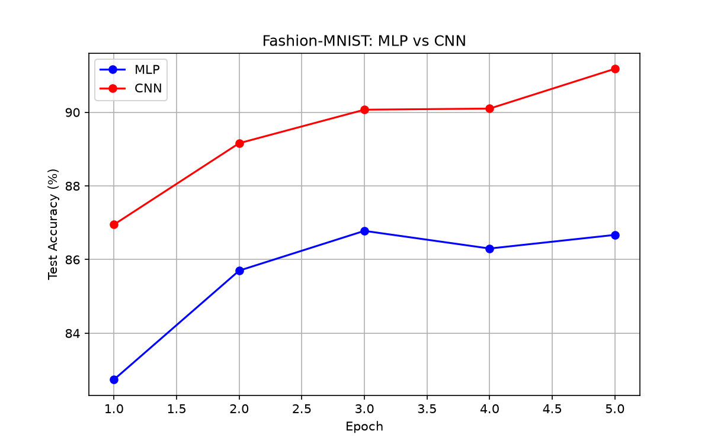

Level 1

### 网络结构
- Flatten: 28×28 → 784
- Linear(784, 256) + ReLU
- Linear(256, 10)
- 总参数量: 203,530

### 超参数

|    参数    |    值    |
| Batch Size |    64    |
|   Epochs   |    10    |
|   学习率   |   0.001  |
|   优化器   |   Adam   |
|  损失函数  | CrossEntropyLoss |

### 实验结果
- 最终测试集准确率: 97.33%
- 训练 Loss 曲线和准确率曲线见 level1/training_curves.png

Level 2

### CNN 训练曲线

CNN 的 Loss 下降速度比 MLP 更快，在第1个 Epoch 就达到了 98% 的准确率。

### MLP vs CNN 对比

从对比图可以看出：
- CNN 的 Loss 下降更快（红色线比蓝色线低）
- CNN 的最终准确率更高（红色线比蓝色线高）
- CNN 收敛更快（更早到达 95%）

### Fashion-MNIST 对比

Fashion-MNIST 是衣服鞋包的图片（T恤、裤子、鞋子等），特征更复杂。
CNN 在处理复杂图像特征时更加强大。

